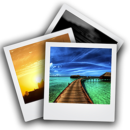

Glass-Gallery
=============

## Overview

 

As the name implies, this project is a Gallery for Google Glass.  There is currently no way to view pictures/videos on the device that you've taken with Glass, without searching through your large Timeline.  We hope to provide a better alternative.

We're working on recreating the standard Android Gallery app (along with most of its functionality) for Glass.  The app acts as a live card where you can select either 'Pictures' or 'Videos' stored on the device, and the media is ordered from newest to oldest.

 

## Current Features

- View Pictures
- View Videos
- Delete Pictures and Videos
- View details for Pictures and Videos (title, date captured, file format, and size)
 
## Future Features

- Option to share any media file (this is currently hindered by the GDK, so as soon as this is updated, we will include this functionality)
